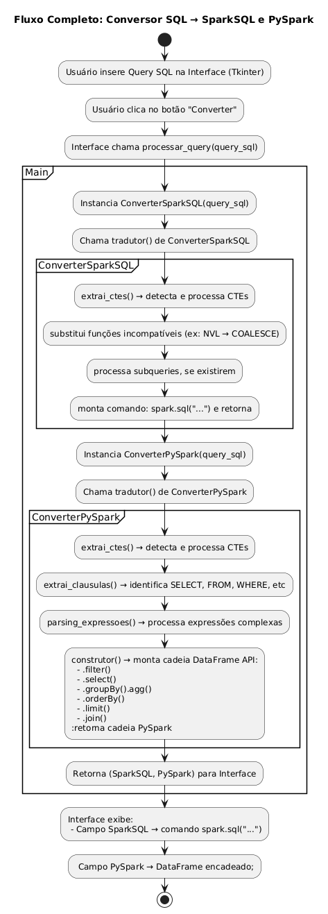

# 🚀 SparkMigrator  
**Desafio Hackathon | Squad 07 - Compass UOL**

---

## 📌 Sobre o Projeto

O **SparkMigrator** é uma ferramenta desenvolvida em Python que interpreta queries SQL tradicionais e as converte automaticamente para comandos equivalentes em **PySpark** ou **Spark SQL**. 

Seu principal objetivo é facilitar a migração de sistemas baseados em SQL tradicional para ambientes Apache Spark, agilizando o trabalho de analistas, engenheiros e cientistas de dados que precisam modernizar pipelines e consultas em big data.

---

## 🎯 Objetivo

- Receber queries SQL padrão, incluindo cláusulas como `WITH`, `JOIN`, `GROUP BY`, `HAVING` e outras.
- Analisar a estrutura da query usando a biblioteca `sqlparse`.
- Gerar duas versões equivalentes:
  - Spark SQL, via `spark.sql("...")`.
  - PySpark, utilizando a API DataFrame com encadeamento de métodos (`.filter()`, `.groupBy()`, `.agg()`, etc.).

---

## 🧠 Como Funciona

1. **Entrada:** O usuário fornece uma query SQL, seja diretamente no terminal ou por meio de um arquivo.
2. **Análise:** A query é analisada e seus componentes são extraídos com a biblioteca `sqlparse`.
3. **Tradução:** O conteúdo é processado para montar as consultas equivalentes.
4. **Conversão:** São geradas as versões convertidas em Spark SQL e PySpark.
5. **Saída:** As versões convertidas são exibidas no terminal e podem ser exportadas conforme necessidade.

---

## 🔀 Fluxograma do Funcionamento



---

## 📁 Estrutura do Projeto

- Desafio-Hackaton-Squad-07-Compasso/
  - database_script.sql — Script SQL auxiliar
  - .gitignore — Arquivos ignorados pelo Git
  - README.md — Documentação geral do projeto
  - principal/
    - interface.py — Interface gráfica para execução
    - main.py — Ponto de entrada principal do projeto
    - readme.md — Documentação específica da pasta principal
    - requirements.txt — Arquivos de dependências do projeto
    - run_interface.bat — Script para executar a interface no Windows
    - teste_sql.py — Script para testes manuais de conversão SQL
    - tradutorPySpark.py — Conversor de SQL para PySpark
    - tradutorSparkSQL.py — Conversor de SQL para Spark SQL
  - tests/
    - test_tradutor_pyspark.py — Testes unitários para o tradutor PySpark
    - test_tradutor_spark_sql.py — Testes unitários para o tradutor Spark SQL

 

---

## 🚀 Como Usar o Projeto

Siga os passos abaixo para clonar, configurar e executar o projeto corretamente.

### ✅ 1. Clone o repositório

```bash
git clone https://github.com/joaopierretcompasso/Desafio-Hackaton-Squad-07-Compasso.git
cd Desafio-Hackaton-Squad-07-Compasso/principal
```

### ✅ 2. Crie e ative o ambiente virtual

#### No **Windows**:

```bash
python -m venv venv
venv\Scripts\activate
```

#### No **Linux/MacOS**:

```bash
python3 -m venv venv
source venv/bin/activate
```

### ✅ 3. Instale as dependências

```bash
pip install -r requirements.txt
```

### ✅ 4. Execute o projeto

#### Para rodar a aplicação principal:

```bash
python main.py
```

#### Ou, se preferir utilizar a interface interativa:

```bash
python interface.py
```

### ✅ 5. Resultado esperado

- ✅ A query SQL original
- ✅ A versão convertida para Spark SQL
- ✅ A versão convertida para PySpark

---

## 🛠️ Requisitos

- Python 3.7 ou superior
- Pip
- Git

---

## ⚙️ Tecnologias Utilizadas

- 🐍 Python 3.7+
- 🧩 sqlparse – parsing e análise de queries SQL
- 🔥 Apache Spark – geração de código para SparkSQL e PySpark
- 💻 Tkinter – interface gráfica do usuário
- ⚡ Regex (re) – processamento de strings e extração de cláusulas SQL
- 🧪 pytest/unittest – testes automatizados
- ☁️ Amazon Q e AI Cockpit – apoio na geração de código


---

## 🧪 Exemplo de Uso

### Query SQL de entrada

```sql
SELECT cliente_id, SUM(valor_compra) AS total_compras
FROM vendas
WHERE ano = 2024
GROUP BY cliente_id
HAVING total_compras > 1000
ORDER BY total_compras DESC

- Spaark SQL:
spark.sql("""
SELECT cliente_id, SUM(valor_compra) AS total_compras
FROM vendas
WHERE ano = 2024
GROUP BY cliente_id
HAVING total_compras > 1000
ORDER BY total_compras DESC
""")

- PySpark:
vendas_df \
    .filter("ano = 2024") \
    .groupBy("cliente_id") \
    .agg(F.sum("valor_compra").alias("total_compras")) \
    .filter("total_compras > 1000") \
    .orderBy(F.desc("total_compras"))

```
--- 

👥 Autoria
Projeto desenvolvido pela Squad 07 durante o Hackathon promovido pela Compass UOL.
Nosso objetivo foi criar uma solução prática e automatizada para migração de queries SQL tradicionais para Spark, aplicando boas práticas de desenvolvimento e automação.